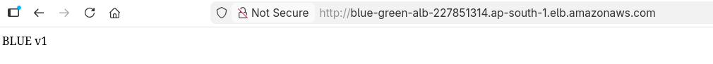
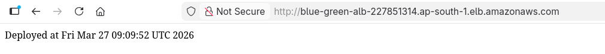
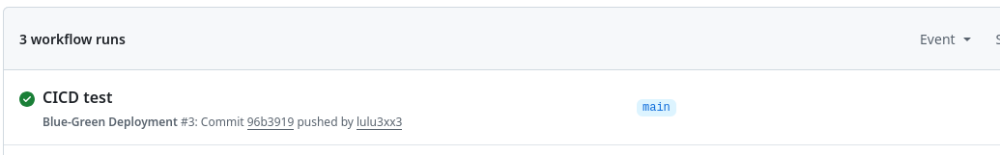
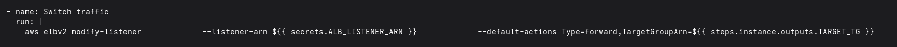

# Blue-Green Deployment with AWS + GitHub Actions

## 🚀 Overview
This project demonstrates a zero-downtime Blue-Green deployment using AWS and GitHub Actions.

## 🧱 Architecture
- 2 EC2 instances (Blue & Green)
- Application Load Balancer (ALB)
- 2 Target Groups
- GitHub Actions CI/CD
- IAM OIDC (no access keys)

## ⚙️ How it works
1. Code is pushed to GitHub
2. GitHub Actions pipeline runs
3. Pipeline detects active environment (Blue/Green)
4. Deploys to inactive EC2 instance
5. Waits for health check
6. Switches ALB traffic to new environment

## 🔁 Zero Downtime Deployment
Traffic is switched only after the new environment becomes healthy.

## 📸 Screenshots

### Before Deployment

### After Deployment

### CI/CD Pipeline

### Traffic Switching

## 🛠️ Tech Used
- AWS EC2
- Application Load Balancer
- GitHub Actions
- IAM (OIDC)
- Nginx

## 💡 Key Learnings
- Blue-Green deployment strategy
- CI/CD pipeline automation
- AWS networking and ALB routing
- IAM OIDC authentication (secure, no keys)
